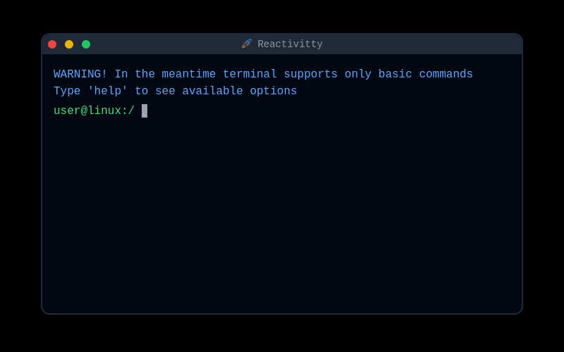

# dmitrii.online

## January 2023 - now

### Google Lighthouse Score


### Description



[Dmitrii Ivanushkin](dmitrii.online) is my personal web page. Originally made as React SPA (that is still available as [v1](https://github.com/lasjdhu/web-page/tree/v1/) in my branches), now it's an Astro static website.
I decided to switch to Astro for SEO purposes and because of great support for Markdown format, in which my blog articles are written. I still use React for JS-heavy elements like Three.js dynamic **duck** model and **Reactivitty** terminal-like
component. Astro supports [Islands architecture](https://docs.astro.build/en/concepts/islands/) so I can easily integrate such components into my static site and get the best out of both Astro and React.

### Usage

If you (for some reason) want to setup dev environment for this project you can clone this repo and run:

```sh
pnpm i
```
```sh
pnpm dev
```

> **_NOTE:_** check `astro.config.mjs` file and create your own `.env` file to integrate [Web3Form](https://web3forms.com/) and [PostHog](https://posthog.com/) services

### Technology stack

- Astro
- React
- TailwindCSS
- Three.js
