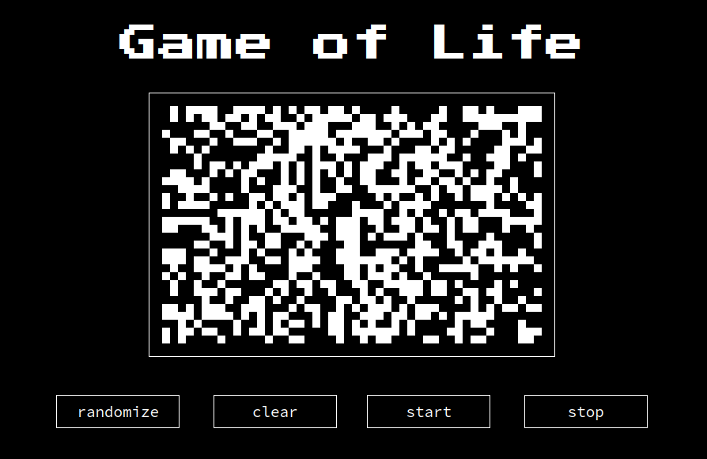

# Game of Life

## January 2023

### Description

The Game of Life, also known simply as Life, is a cellular automaton devised by the British mathematician John Horton Conway in 1970. It is a zero-player game, meaning that its evolution is determined by its initial state, requiring no further input. One interacts with the Game of Life by creating an initial configuration and observing how it evolves. It is Turing complete and can simulate a universal constructor or any other Turing machine.
[Wikipedia](https://en.wikipedia.org/wiki/Conway%27s_Game_of_Life)

### Implementation details

The game was implemented in JavaScript with HTML/CSS layot. Globally there are two classes `Cell` and `Game`. User creates an initial configuration restaring the page or by clicking the button `randomize`.
